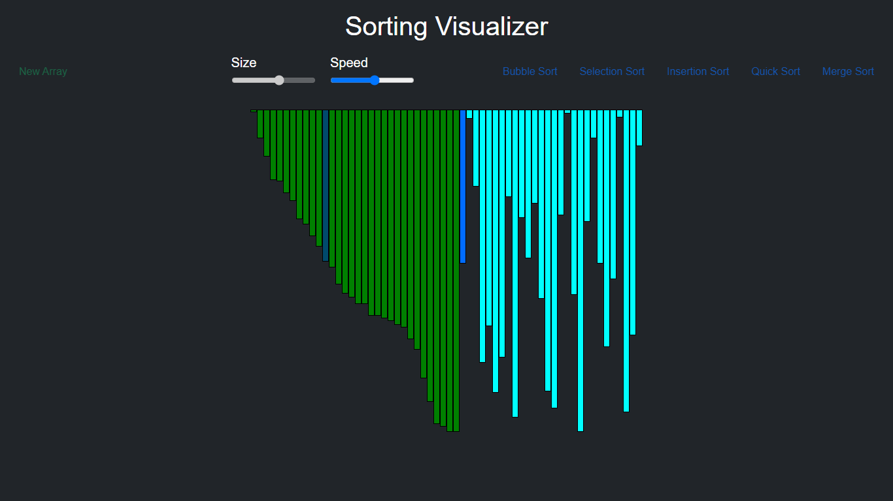

# Sorting-Visualizer

A web application showcasing the inner workings of sorting algorithms.
### This is a simple visualization project made using javascript 

Implemented algorithms:
1) Bubble sort
2) Selection sort
3) Insertion sort
4) Merge sort
5) Quick sort

### This is built using HTML, CSS, JavaScript  

#### Features:
1) Colored representation of step being executed:  
  1.1) Cyan:default  
  1.2) Blue: Being compared  
  1.3) Green: In correct position  
  
2) 3 Controls for visualizations:  
  2.1) Speed of visualization  
  2.2) Data size ()  
  2.3) Generation of new data (Randomly generate new data)  

### Example:  
1) Bubble sort:  
  

2) Selection sort:  
  

3) Insertion sort:  
  
